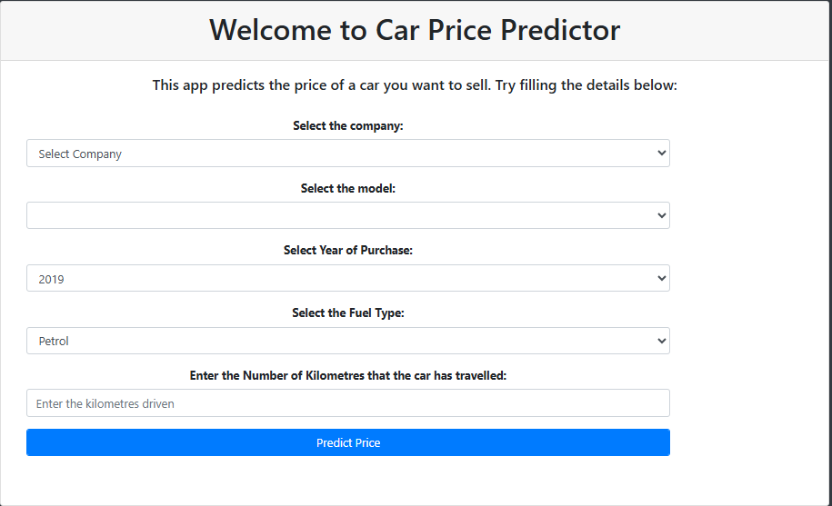
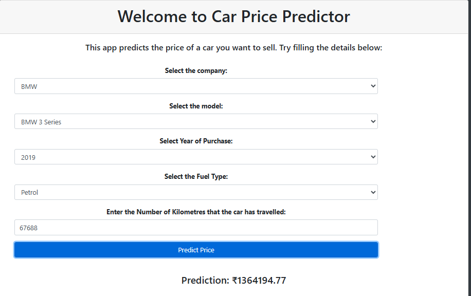

# 🚗 Car Price Predictor — Machine Learning Web App

> A Machine Learning project that predicts the selling price of a car based on data.

---

## 🔍 Project Overview

Car pricing is influenced by many factors — brand, age, mileage, condition, fuel type, etc. This project uses **machine learning regression** techniques to estimate the *market value* of a car using features from real-world data.  
It includes:

✔ Data cleaning & preprocessing  
✔ Exploratory data analysis  
✔ Regression model training  
✔ Web application for interactive predictions  
✔ Deployment-ready Flask backend

---

## 🧠 Key Features

- 📊 **Machine Learning Model:** Predicts car prices using regression  
- 🛠️ **Cleaned Dataset:** `Cleaned_Car_data.csv` used for training  
- 🧪 **Model File:** Pretrained `LinearRegressionModel.pkl`  
- 🖥️ **Interactive UI:** Users can input features and get predictions  
- 📈 **Visual Feedback:** Prediction results displayed intuitively

---

## 📁 Repository Structure
├── static/
│ └── css/ # CSS styles for UI
├── templates/ # HTML templates
├── Cleaned_Car_data.csv # Processed dataset
├── LinearRegressionModel.pkl # Trained ML model
├── application.py # Flask app
├── Landing_page.png # Landing page screenshot
├── prediction.png # Prediction result screenshot
├── quikr_car.csv # Raw dataset
├── requirements.txt # Python dependencies
└── Quikr Analysis.ipynb # EDA & model training notebook

---

## 🛠️ How It Works

1. **Data Preparation**  
   Clean and preprocess the dataset to handle missing values, encode categorical variables, and normalize features. :contentReference[oaicite:0]{index=0}

2. **Model Training**  
   Use regression algorithms (like Linear Regression) to train a model that learns from historical car prices.

3. **Web Application**  
   A Flask app (`application.py`) loads the trained model and serves an interactive form.  
   Users enter car details → get a **predicted price**.

---

## 🚀 Preview
### 👇 Landing Page UI

### 🔮 Price Prediction Result

